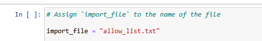
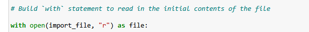
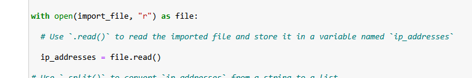
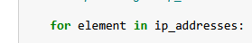
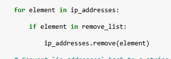
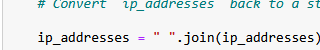
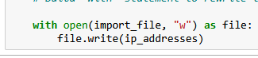

# Update a File Through a Python Algorithm  

---

## Project Description
In this project, I worked with access control data used by my organization’s health care systems. Access to restricted patient-related content is controlled through an allow list of approved IP addresses. A separate remove list identifies IP addresses that should no longer have access. My goal was to design a Python-based process that automatically updates the allow list by removing any IP addresses that appear in the remove list. This helps maintain accurate access permissions and ensures only authorized employees can enter the restricted subnetwork.

---

## Open the File That Contains the Allow List
To begin, I prepared the algorithm to access the contents of `"allow_list.txt"`. I assigned the file name to a variable and used a `with` statement to open the file in read mode. This ensured that Python handled the file safely and closed it once the operation was completed. My purpose at this stage was simply to load the current list of approved IP addresses so the program could analyze and later modify them.

---

## Read the File Contents
Once the file was open, I used the `.read()` method to convert its contents into a single string. Storing the data as a string made it easier to process in subsequent steps. This approach allowed the algorithm to work with the entire allow list as a block of text before breaking it into manageable units.

---

## Convert the String Into a List
To prepare for removing specific IP addresses, I converted the string into a list using the `.split()` method. The allow list contains IP addresses separated by whitespace, so calling `.split()` transformed the text into an iterable list. This step was essential, as list data structures allow items to be removed individually—something that isn’t possible when working with a plain string.

---

## Iterate Through the Remove List
The core of the algorithm centers on checking each IP address in the remove list. I used a `for` loop to cycle through each item and evaluate whether it also appeared in the allow list. This provided a structured way to apply removal logic to every entry in the remove list without missing any values.

---

## Remove IP Addresses That Are on the Remove List
Within the loop, I added a conditional check to confirm that the element existed in the allow list before attempting to remove it. This prevented potential errors and ensured the `.remove()` method was used only when appropriate. Each matching IP address was removed one by one, trimming the allow list to reflect only valid, current access permissions.

---

## Update the File With the Revised List of IP Addresses
After cleaning the allow list, I needed to update the original file. I converted the list back into a properly formatted string using the `.join()` method, placing each IP address on its own line. Then I opened `"allow_list.txt"` again—this time in write mode—to overwrite the old contents with the updated list. This final step ensured that unauthorized IP addresses were fully removed from the system’s access control file.

---

## Summary
I created an automated algorithm that updates the `"allow_list.txt"` file by removing IP addresses found in a separate `remove_list`. The process involved reading the file, converting its contents into a list, iterating through the remove list to identify matches, removing any unauthorized entries, and writing the updated IP address list back to the file. This solution ensures that access to sensitive health care data is kept current and secure without requiring manual updates.
